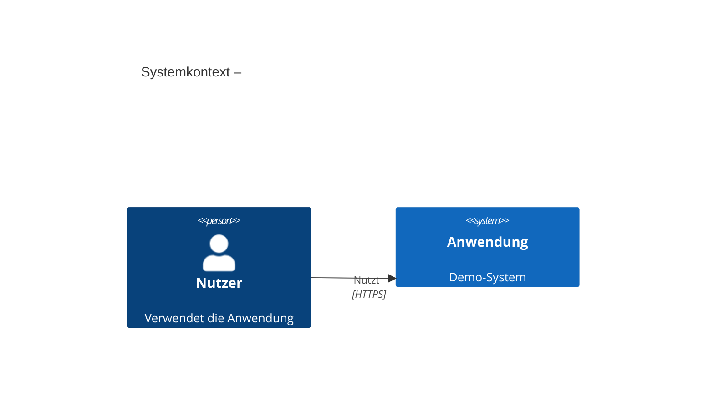

# Copilot Instructions – Documentation (Docs-as-Code)

Dokumentation ist **Pflichtbestandteil jeder abgeschlossenen Story / jeden abgeschlossenen Bugs**.
Sie liegt unter `./docs`, ist stack-übergreifend und wird wie Code versioniert, reviewed und gemerged.

---

## Allgemeine Prinzipien

- **Docs-as-Code:** Dokumentation in Markdown, in Git, im selben PR wie der Code
- Zielgruppe ist ein **technisches Publikum** (Entwickler, Architekten)
- **Klarheit vor Vollständigkeit** – lieber kürzer und korrekt als lang und veraltet
- Kein separater Doku-Prozess – Doku entsteht mit dem Feature, nicht danach

---

## Ordnerstruktur

```
docs/
├── architecture.md          # Überblick: Ziele, Kontext, Struktur, ADR-Verweise
├── adr/                     # Architecture Decision Records
│   ├── 0001-<titel>.md
│   └── 0002-<titel>.md
├── diagrams/                # C4-Diagramme (Mermaid)
│   ├── context.md           # C4 Level 1 – Systemkontext
│   ├── container.md         # C4 Level 2 – Container/Services
│   └── deployment.md        # Deployment-Topologie
└── features/                # Feature-Dokumentation (je Feature eine Datei)
    └── <feature-name>.md
```

---

## Architektur-Dokumentation (`architecture.md`)

Struktur bei Erstellung oder Update:

1. **Ziel & Scope** – Was macht das System, für wen?
2. **Qualitätsziele** – Top-3 Qualitätsattribute (z.B. Wartbarkeit, Sicherheit)
3. **Systemkontext** (C4 Level 1) – externe Akteure und Systeme
4. **Container / Komponenten** (C4 Level 2) – interne Bausteine
5. **Laufzeitszenarien** – wichtige Abläufe als Sequenzdiagramme
6. **Deployment** – Infrastruktur, Umgebungen
7. **Architekturentscheidungen** – nur Verweise auf ADRs, keine Inline-Entscheidungen
8. **Risiken / Tech Debt** – bekannte Schwachstellen

---

## Architecture Decision Records (ADRs)

- **Jede bewusste Architekturentscheidung** bekommt ein ADR in `docs/adr/`
- Niemals Entscheidungen direkt in `architecture.md` inline dokumentieren
- Dateiname: `<nummer>-<kurztitel>.md` (z.B. `0003-use-tanstack-query.md`)
- Format:

```markdown
# ADR-<nummer>: <Titel>

## Status
Akzeptiert | Abgelehnt | Ersetzt durch ADR-<nr>

## Kontext
Warum musste eine Entscheidung getroffen werden?

## Entscheidung
Was wurde entschieden?

## Konsequenzen
Was sind die positiven und negativen Folgen dieser Entscheidung?
```

---

## Feature-Dokumentation (`docs/features/<feature>.md`)

Jede abgeschlossene Story ergänzt oder aktualisiert die zugehörige Feature-Doku.

Minimalstruktur:

```markdown
# <Feature-Name>

## Überblick
Kurzbeschreibung des Features (1–3 Sätze).

## Fachliche Anforderungen
Verweis auf die Story / das Issue (#<nr>)

## Technischer Ansatz
Welche Komponenten sind betroffen? Wie ist der Datenfluss?

## API / Schnittstellen (falls relevant)
Endpunkte, Request/Response-Beispiele

## Bekannte Einschränkungen / offene Punkte
```

---

## Diagramme

- Standard: **Mermaid** (wird in GitHub direkt gerendert)
- Alternativ: PlantUML
- C4-Modell-Terminologie verwenden (Person, System, Container, Component)
- Jedes Diagramm hat **genau einen Fokus** – lieber mehrere kleine als ein großes
- Diagramme immer mit kurzem Erklärungstext versehen



---

## Schreibstil

- Deutsch für alle Dokumentation
- Kurze Sätze, Aufzählungslisten bevorzugen
- Keine langen Fließtextblöcke
- Technische Begriffe konsistent verwenden (einmal festlegen, immer gleich schreiben)

---

## Anti-Patterns

- ❌ Doku-Dateien ohne Aktualisierung beim Code-Change mergen
- ❌ Diagramme ohne begleitenden Text
- ❌ Architekturentscheidungen direkt in `architecture.md` statt als ADR
- ❌ Feature-Doku nach dem Merge nachholen – sie gehört in denselben PR
- ❌ Duplizierung von Informationen aus dem Code (kein "was" dokumentieren, das der Code selbst zeigt – das "warum" dokumentieren)

---

## Good Practices

- ✅ Doku im selben PR wie der Feature-Code
- ✅ ADRs verlinken aus `architecture.md` und aus betroffenen Feature-Docs
- ✅ Diagramme als Mermaid direkt in Markdown (kein externes Tool nötig)
- ✅ Bei Unklarheit: einfacher und kürzer ist besser
- ✅ Bestehende Struktur konsistent weiterführen
