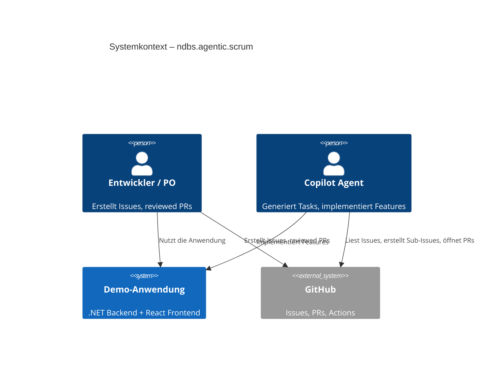

# Architektur – ndbs.agentic.scrum

## 1. Ziel & Scope

Demo-Anwendung zur Veranschaulichung eines Agentic-Scrum-Workflows mit GitHub Copilot.
Zeigt, wie Menschen schlanke Epics/Stories/Bugs erstellen und Copilot daraus vollständig
ausgearbeitete Tasks generiert und eigenständig abarbeitet.

## 2. Qualitätsziele

| Priorität | Qualitätsziel    | Motivation                                              |
|-----------|------------------|---------------------------------------------------------|
| 1         | Wartbarkeit      | Demo-Code muss als Vorlage dienen – klar und verständlich |
| 2         | Erweiterbarkeit  | Neue Features sollen ohne Architekturbrüche ergänzbar sein |
| 3         | Testbarkeit      | Business-Logik muss isoliert testbar sein               |

## 3. Systemkontext (C4 Level 1)

## 4. Container (C4 Level 2)

> Wird mit dem ersten Feature ergänzt. Siehe `docs/diagrams/container.md`.

## 5. Laufzeitszenarien

> Werden je Feature in `docs/features/<feature>.md` dokumentiert.

## 6. Deployment

> Wird mit dem ersten Deployment-Setup ergänzt. Siehe `docs/diagrams/deployment.md`.

## 7. Architekturentscheidungen

| Nr.   | Titel                        | Status     |
|-------|------------------------------|------------|
| –     | *(noch keine ADRs vorhanden)* | –         |

## 8. Risiken / Tech Debt

| Risiko                  | Maßnahme                          |
|-------------------------|-----------------------------------|
| Demo-Scope überschreiten | Scope klar in Issues abgrenzen   |
